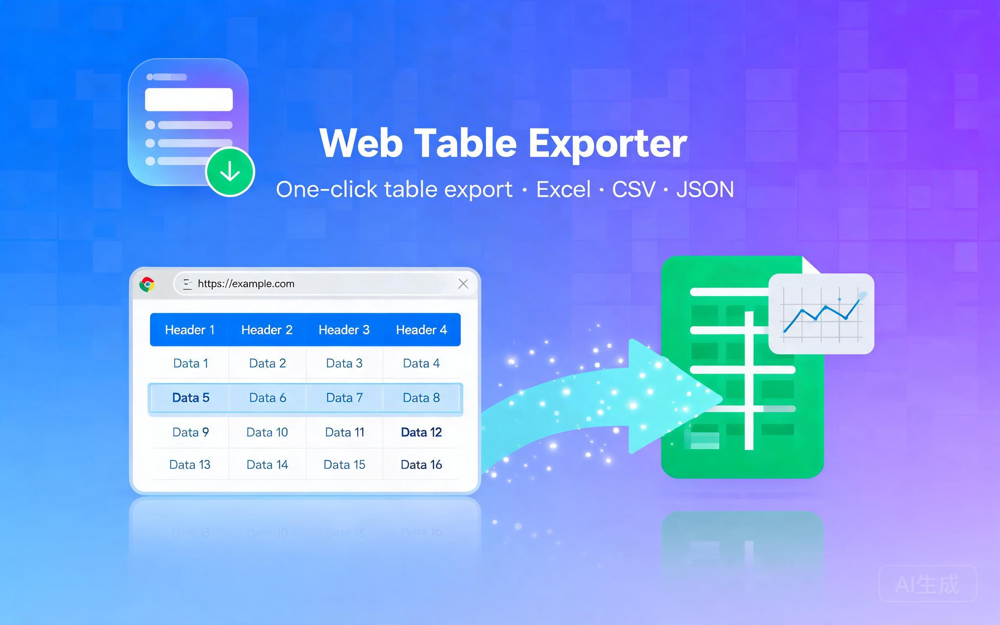
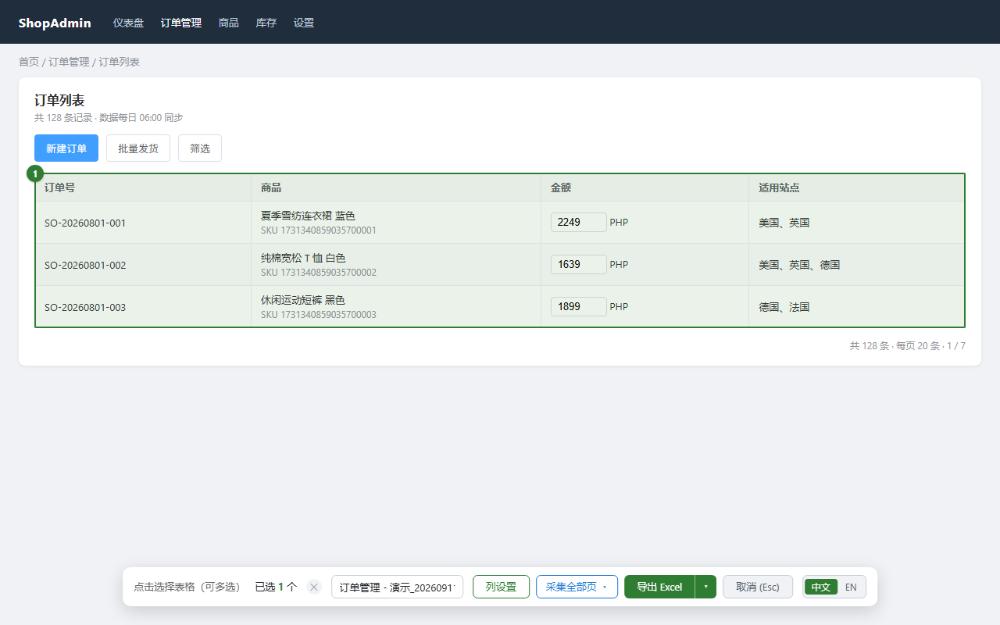
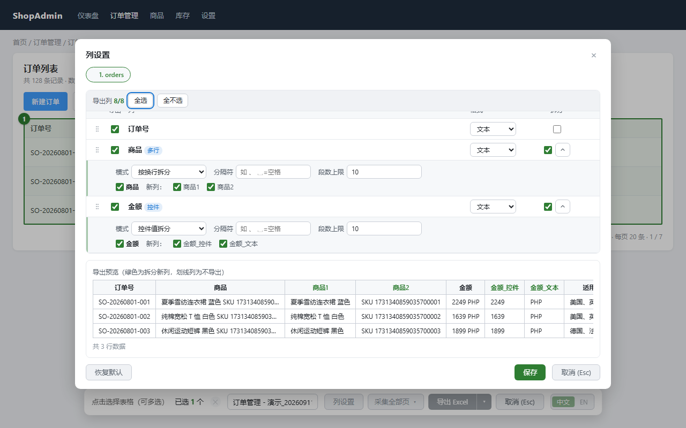

# Web Table Exporter

网页表格一键导出为 xlsx / csv / json / md / html 的 Chrome/Edge 扩展（Manifest V3，原生 JS，零构建）。悬浮选择、点击导出，无需复制粘贴。



## 核心亮点

- **虚拟滚动全量采集**：vxe-table、el-table-v2、AG Grid 等只渲染可见行的表格，点击后自动滚动采集全部数据并去重，无需手动翻页
- **分页表格自动翻页采集**：el-pagination / ant-pagination / vxe-pager 自动识别，点「采集全部页」逐页翻页并显示「第 i/N 页」进度；自建分页器点击一次「下一页」即可，跨页自动跟随，且指定一次即按页面记住、下次直接复用
- **主流组件适配**：Element Plus、AG Grid、MUI X DataGrid、Tabulator、Ant Design Vue 等组件表格直接识别；适配器注册表架构，新增组件只加适配器
- **表单控件取值**：单元格内的输入框、下拉框、开关等按当前值导出
- **列规则按页面记忆**：拆分/筛选/列顺序/格式设置默认存本机，登录 Chrome 账号时随账号同步到其它设备；重进同页面自动恢复，面板「恢复默认」可一键重置并清除本页记忆
- **列顺序可调**：面板里拖动列前手柄调整导出列序（拆分出的新列跟随原列），随列设置一并记住
- **记住输出方式与文件名**：上次选的格式（含「复制为…」）下次进页面直接生效；文件名支持 `{title}` 页面标题 / `{date}` 日期 / `{time}` 时间模板，写一次即每次自动带上页面名与日期
- **复制到剪贴板**：不想落盘时选「复制为表格 (TSV)」直接贴进 Excel / 飞书，或「复制为 Markdown」贴进文档，列设置同样生效
- **中英双语界面**：界面文案与导出内容（控件「是/否」、Sheet 兜底名等）随浏览器语言自动切换；工具栏「中文 | EN」可手动指定并记住选择
- **隐私友好**：不收集任何数据，权限最小化（activeTab / scripting / downloads / storage）

## 安装

| 方式 | 适用人群 | 特点 |
| --- | --- | --- |
| **商店安装** | Chrome 用户 | 一键安装、自动更新、无需开发者模式 |
| **开发者模式加载** | 其它浏览器 / 开发者 | 直接加载本项目源码，改动即生效，但需手动更新 |

### 商店安装（推荐）

只有 Chrome 能通过商店安装。从 [Chrome 应用商店](https://chromewebstore.google.com/detail/web-table-exporter%EF%BC%9A%E5%AF%BC%E5%87%BA%E8%A1%A8%E6%A0%BC/mcmhdpnenfjbopbdkkhfhjbndnndnamo) 点击「添加至 Chrome」，安装后浏览器自动更新。

### 开发者模式加载

Edge、Firefox 等其它浏览器同样可用，仅需将 `chrome://extensions` 换成对应地址（如 Edge 的 `edge://extensions`）：

1. `chrome://extensions` → 开启「开发者模式」→ 「加载已解压的扩展程序」→ 选 `extension/` 目录
2. 更新：`git pull` 后回 `chrome://extensions` 点「刷新」
3. （可选）本地 HTML 文件使用：扩展详情 → 打开「允许访问文件网址」

## 使用

1. 点击扩展图标进入选择模式（再次点击图标或按 `Esc` 退出）
2. 鼠标悬浮高亮表格，点击选中（可多选；选错了点计数旁「✕」一键清空，不退出选择模式）



3. （可选）「列设置」配置：
   - **拆分**：按控件值 / 换行 / 分隔符把一列拆成多列（智能预填 + 前 3 行实时预览）
   - **筛选**：逐列勾选导出，拆分新列同样可筛
   - **排序**：拖动列前「⋮⋮」手柄调整导出列序（拆分出的新列跟随原列），支持 Alt+↑/↓ 键盘移动
   - **格式**：标记数字列，导出为数值可求和
   - **恢复默认**：底部「恢复默认」一键重置本表格列设置（不拆分、全列、文本），保存后清除本页记忆

   

4. （可选）分页表格：点「采集全部页 ▾」展开设置，填页数上限（留空 = 全部页）后点「开始采集」，自动回第一页逐页翻页采集，工具栏实时显示「第 i/N 页」（仅支持单表；识别不到分页器时按提示点击一次「下一页」按钮，该按钮会按页面记住，下次直接复用）
5. 工具栏修改文件名、选择输出方式（默认 xlsx，选过一次即记住），点「导出」或按 `Enter`（多表导出期间可点「停止导出」中止，已下载的文件保留）；不想落盘可选「复制为表格 (TSV)」贴进 Excel/飞书 或「复制为 Markdown」贴进文档，点按钮即进剪贴板。文件名可写 `{title}` / `{date}` / `{time}` 占位符（鼠标悬停有说明），编辑一次即记住，清空则回到默认命名
6. 想换界面语言：工具栏最右侧「中文 | EN」点选即可即时切换并记住（默认跟随浏览器语言；再点当前语言恢复跟随）

工具栏实时显示采集进度，采完自动还原滚动位置/回到起始页；选择模式下页面交互照常可用（翻页、筛选、切 Tab 不拦截），深色模式跟随系统。

**适用场景**：后台管理系统数据导出、电商订单表格整理、报表搬运、数据核对。

## 目录结构

```
├── extension/                  # 插件本体（chrome://extensions 加载此目录）
│   ├── manifest.json           # MV3 配置（activeTab / scripting / downloads / storage + default_locale 国际化）
│   ├── _locales/               # 国际化语言包（en 英文全量 / zh_CN 中文，见 docs/architecture.md）
│   ├── background/service-worker.js  # 图标点击注入 + 后台下载 + 语言词表
│   ├── content/                # 内容脚本（按依赖序注入，零构建无模块系统）
│   │   ├── entry.js            #   注入守卫 + window.__h2x 命名空间
│   │   ├── i18n.js             #   界面语言（手动中英文开关 + 各模块 t() 统一取词入口）
│   │   ├── util.js             #   工具函数
│   │   ├── controls.js         #   控件值三层判定（详见 docs/controls.md）
│   │   ├── split.js            #   列拆分 + 列筛选 + 列顺序 + 列格式纯函数（测试整文件加载）
│   │   ├── cell.js             #   单元格四通道取值
│   │   ├── table.js            #   行获取 / 合并单元格展开 / 网格适配器注册表 / Sheet 命名
│   │   ├── virtual.js          #   虚拟滚动表格采集
│   │   ├── pagination.js       #   分页表格自动翻页采集（方案见 docs/pagination-plan.md）
│   │   ├── persist.js          #   拆分规则/列筛选/列顺序/列格式持久化（本机 + 随 Chrome 账号同步）
│   │   ├── format.js           #   csv/tsv/json/md/html 导出格式序列化纯函数（tsv 供剪贴板）
│   │   ├── panel.js            #   列设置面板（列筛选 + 列顺序 + 拆分配置 + 列格式）
│   │   └── main.js             #   主 UI / 事件 / 导出
│   ├── lib/xlsx.full.min.js    # SheetJS 0.20.3（Apache-2.0）
│   └── icons/                  # 图标 16/32/48/128（test/gen-icon.ps1 生成）
├── test/                       # 测试材料（不随插件分发，覆盖矩阵见 test/README.md）
│   ├── algo-check.cjs          # 纯函数离线回归（采集/拆分/筛选/格式/分页/持久化，Node 直接运行）
│   ├── fixture.html            # 基础测试页（合并单元格/控件取值/列拆分/列筛选/列格式）
│   ├── virtual-fixture.html    # 虚拟滚动测试页（60 行，含 input 列）
│   ├── {tablev2,antdv,aggrid,mui,tabulator}-fixture.html  # 五类组件表格 fixture
│   ├── pagination-{el,ant,manual}-fixture.html  # 分页采集测试页（el / ant / 自建手动指定；el 与 manual 两页附 E2E harness）
│   ├── auto-check.html         # DOM 层自动化回归（页内自判 PASS/FAIL）
│   ├── e2e-harness*.js         # 九页 E2E 注入回归（无扩展环境：七页组件/虚拟 + 分页采集 el / manual）
│   ├── run-all.ps1             # 一键回归（语法 + 算法 + 九页 E2E 并行）
│   └── gen-icon.ps1            # 重新生成扩展图标（四尺寸）
├── release/                    # Chrome Web Store 上架材料（商店文案/截图/打包脚本）
└── docs/                       # 文档（架构 / 产品 / 控件规则 / 分页采集方案 / GitHub 远程操作 / archive 归档方案）
```

## 开发与测试

```powershell
# 语法检查（内容脚本 13 文件 + 后台脚本）
Get-ChildItem extension/content/*.js | ForEach-Object { node --check $_.FullName }
node --check extension/background/service-worker.js

# 回归测试（采集算法 + 列拆分/列筛选 + 持久化 + 导出格式序列化纯函数）
node test/algo-check.cjs

# 一键回归（语法 + 算法 + 9 页 E2E 并行，约 5 秒）
test/run-all.ps1

# 启动本地静态服务后访问 http://localhost:3000/test/virtual-fixture.html
npx -y serve .
```

修改代码后：`chrome://extensions` 刷新扩展 → 刷新目标页面。

## 文档

- [架构文档](docs/architecture.md)：模块划分、数据流、关键设计决策
- [产品文档](docs/product.md)：功能清单、交互规范、已知限制
- [控件值规则](docs/controls.md)：三层判定与覆盖矩阵
- [分页采集方案](docs/pagination-plan.md)：分页器识别、采集引擎与交互设计
- [GitHub 远程操作](docs/github-remote.md)：推送 / Tag / Release 代发与凭据约定
- [测试与回归](test/README.md)：测试页覆盖矩阵、命令、浏览器回归步骤
- 历史方案（已实施归档，设计已并入架构/产品文档）：[列拆分](docs/archive/column-split-plan.md) · [持久化](docs/archive/persist-plan.md) · [UI/UX 优化](docs/archive/uiux-plan.md)

## 许可证

本项目以 [GPL-3.0](LICENSE) 开源发布（详见 LICENSE 全文）。其中内嵌的 SheetJS（[lib/xlsx.full.min.js](extension/lib/xlsx.full.min.js)）属第三方库，以 Apache-2.0 独立授权。
